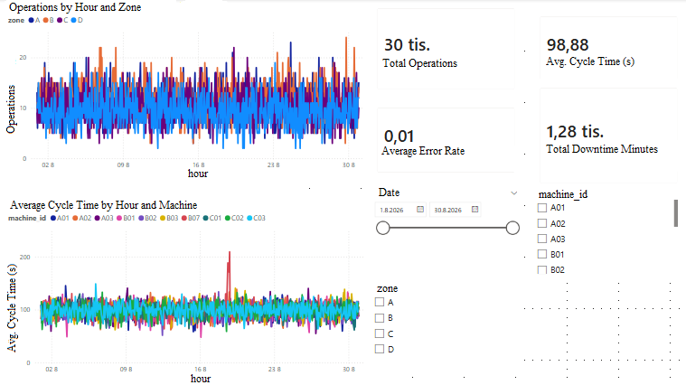

# Automated Warehouse Operations Analytics

Reproducible mini-project for SQL, Power BI, KPI monitoring, and incident analysis in an automated warehouse.

## Features

- reproducible synthetic data generator (`generate_data.py`)
- 30,000 operation rows by default
- one acute incident visible as a multi-KPI peak
- one separate recurring reliability problem
- event log covering every machine
- raw error counts in hourly KPIs, allowing a correctly weighted overall error rate
- blind assignment with a generated answer key for self-check
- randomized incident machines, incident days, and warehouse topology by default
- a fresh random seed on every run unless a seed is supplied explicitly

## Repository contents

These files are part of the repository and exist before the generator is run:

- `generate_data.py` - synthetic data generator
- `ASSIGNMENT.md` - blind analytical assignment
- `sql/analysis.sql` - reusable SQL workflow for screening and drill-down
- `POWER_BI_quickstart.txt` - short Power BI setup notes
- `requirements.txt` - Python dependencies
- `README.md` - project documentation

## Generated files

Running `generate_data.py` creates or replaces the following files in the selected output folder:

- `warehouse_operations.csv` - operation-level synthetic data
- `hourly_kpis.csv` - hourly aggregation for Power BI
- `event_log.csv` - technical event log for all machines
- `warehouse.db` - SQLite database containing the generated tables
- `expected_solution.json` - generated answer key; open only after solving the exercise

These generated files do not need to be stored in the repository if the goal is to keep the project fully reproducible from source.

## Generate / regenerate data

Run from the project folder in the PyCharm terminal:

```bash
python generate_data.py
```

Default settings:

- `--out .` - writes outputs to the current working directory
- `--seed` - optional reproducible seed; if omitted, a fresh random seed is generated and printed after generation
- `--records 30000` - number of operation-level rows
- `--rand-topo` - enabled by default; randomizes machine counts by zone; disable with `--no-rand-topo`
- `--rand-inc` - enabled by default; randomizes acute/chronic incident machines and days; disable with `--no-rand-inc`
- `--show-solution` - optional; prints the generated answer key to the console; hidden by default

The generator is pseudorandom. To reproduce a specific exercise, rerun it with the seed printed by the previous run, for example:

```bash
python generate_data.py --seed 123456789
```

The same combination of `seed + records + rand-topo + rand-inc` produces the same dataset. If `--seed` is omitted, a new seed is generated and therefore a new exercise is produced.

Examples:

```bash
python generate_data.py
python generate_data.py --seed 12345
python generate_data.py --seed 98765 --no-rand-topo
python generate_data.py --seed 42 --no-rand-topo --no-rand-inc
python generate_data.py --records 50000 --out ./generated
python generate_data.py --seed 12345 --show-solution
```

The long aliases `--randomize-topology` and `--randomize-incidents` also work; their negative forms are `--no-randomize-topology` and `--no-randomize-incidents`.

## Blind practice mode

For normal practice, run simply:

```bash
python generate_data.py
```

Do **not** open `expected_solution.json` until the analysis is finished. The console prints only the seed and the location of the answer key, not the answer itself.

If you deliberately disable incident randomization with `--no-rand-inc`, the generator falls back to the fixed demonstrative scenario used during development. That mode is useful for debugging, not for blind practice.

## Analytical approach

Use SQL for systematic screening, candidate ranking, and drill-down. Use Power BI to spot and validate temporal patterns and to communicate the result. A visual peak is a candidate generator, not proof of root cause.

## Power BI dashboard screenshot




